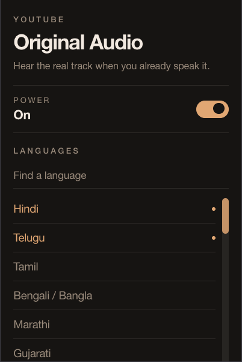

# YouTube Original Audio

YouTube decided you wanted a robot voice.

A Hindi video starts in English. A Tamil video too. You open settings, click Audio track, pick **Hindi original**, and next video it’s back. There is no real off switch for auto-dub.

This extension flips it back to the original track when that language is one you actually speak.



## The problem

YouTube auto-dubs videos into your interface language. The original is still there — labeled `Hindi original`, `Tamil original`, and so on — but it is not the default. You have to hunt for it on every video.

If you understand the original, the dub is worse: delayed, flat, and often wrong.

## The fix

Pick the languages you understand. When a video’s original track matches, it switches. When it doesn’t, YouTube is left alone.

No dubbed English on a Hindi video. No surprise Hindi on an English original you didn’t ask to change.

## Install

Grab the zip from [Releases](https://github.com/saiumesh535/youtube-original-audio/releases). Unzip it, then load that folder as an unpacked extension.

- **Chrome / Edge / Brave:** `chrome://extensions` → Developer mode → Load unpacked
- **Firefox:** `about:debugging` → This Firefox → Load Temporary Add-on → pick `manifest.json`

Or build it yourself:

```bash
pnpm install
pnpm build
```

Load **`dist/`**. Reload the extension after each build, then refresh YouTube.

## Use

Open the popup. Turn it on. Search and select languages. Hindi is selected by default.

That’s it. Play a dubbed video and it should land on original.

## Release

```bash
pnpm release
```

Reads the version from `src/manifest.json`, builds the zip, tags `vX.Y.Z`, and publishes a GitHub Release. Working tree must be clean, and you need `gh` logged in.
